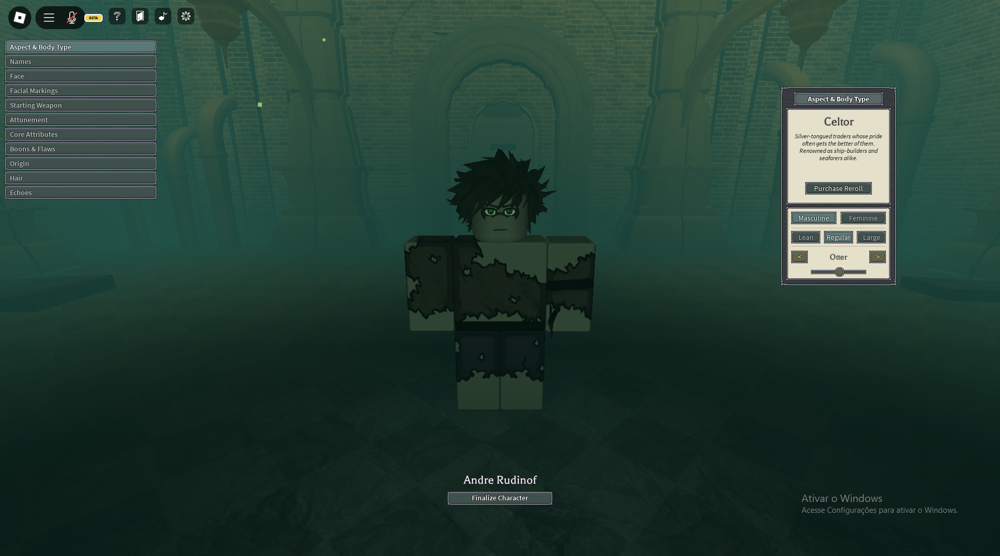
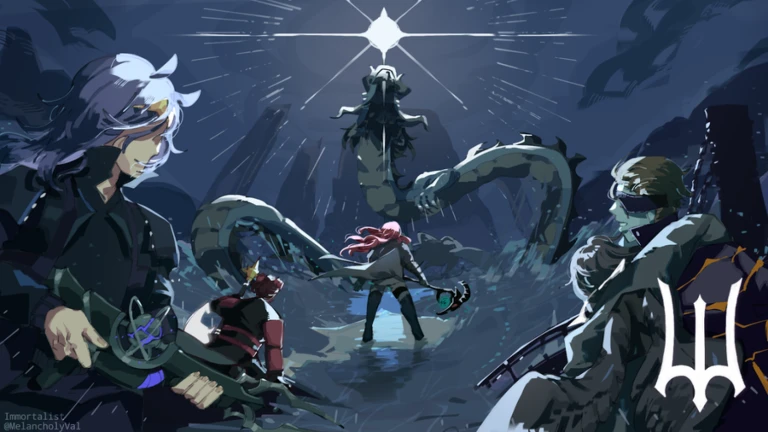
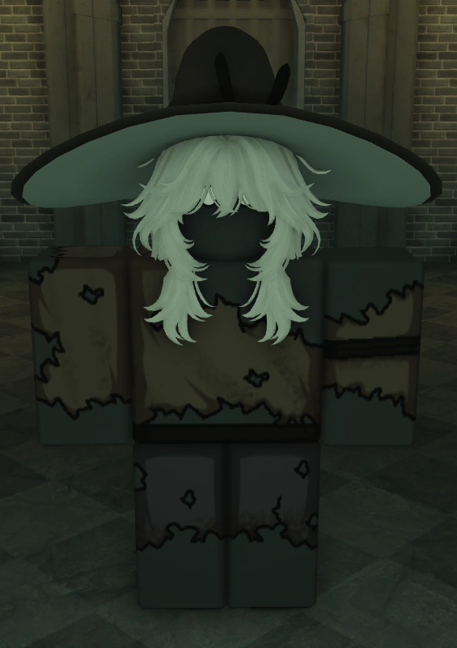
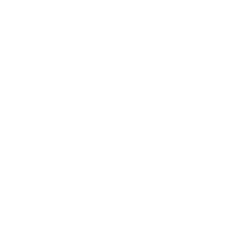

# *GUIA PARA INICIANTES. 1/3⚔📜*

# Olá, Jogador! Seja bem-vindo ao guia de Deepwoken! Queremos te ajudar a dar os primeiros passos nesse mundo cheio de perigos e mistérios... Se você nunca jogou Deepwoken antes, este guia é perfeito para você dar seus primeiros passos no game!
## *Esse guia em especifico é focado em explicar a criação de personagem.*

# Pra que esse guia serve?⚜
## -Esse guia consiste em ensinar minimamente sobre o jogo, para que os iniciantes possam se adaptar melhor ao estilo de gameplay de Deepwoken, pois Deepwoken gosta de dificultar qualquer coisas, até as minimas ações, punindo o jogador de alguma maneira.
 
# O que é o Deepwoken?

## *Deepwoken é um jogo no estilo “souls-like” tendo um tipo extremamente dificil de gameplay, com DIVERSAS mecanicas e coisas para se fazer, o que acaba fazendo Deepwoken perder uma quantidade de player, outro motivo também é: “Sistema de perma-death/Morte permanente”, esse sistema funciona da seguinte maneira: ao morrer 2 vezes na superficie, e uma vez nas profundezas (The Depths) você “obrigatoriamente” terá que perder seu personagem, isso não signfica que você não poderá mais jogar, mas sim que você voltará do zero, apenas para uma nova experiencia.*
# Criação de Personagem.
## (esse tópico vai de raças até origens.)
## --> Raças: 

## _No Deepwoken, existem 12 raças diferentes, com estilos e aparências diferentes, aumentando o estilo do seu personagem._
# (Exemplos de raças)
## Canor

## Capra

## Ganymede

# Não gostei da minha raça, tem como mudar?
### -Sim, no deepwoken é possivel mudar sua raça, por 150 robux (75 em promoção), tendo uma chance de pegar uma das 12 raças que é possivel pegar normalmente, sendo da mais comum ou até a mais rara.
# --> Arma inicial:
## No Deepwoken, temos 3 categorias de armas, sendo elas:
- # Leves
 
- # Médias
 
- # Pesadas
 
- ### _(Não consegui a imagem😭)_

## _Sendo as inicias: Espada, Stiletto/Estilete e Machado._
## *Leves*: Dano reduzido, porém sua velocidade de ataque é aumentada, podendo ter um belo DPS, sendo dificil de dar parry contra esse tipo de arma.

## *Médias*: Dano e velocidade medianas, sendo o padrão de arma, bem “balanceado”

## *Pesadas*: Dano maior, porém menos velocidade de ataque, sendo perfeita para builds PvE,!

# -Existe outros tipos de armas?
## _-Sim, uma variedade *IMENSA* de armas, porém só algumas estão permitidas na criação de personagem, como: Lanças, Estilo de luta, Pistolas, Greatswords e Rapieiras._

# _Attunements_

## _-Da parte da criação de personagens,e temos os *“Attunements”* que se resume no que você pode controlar, sua magia, tendo mantras (sua habilidades)._
## Ether:
### -Ether é basicamente sua mana, o que você usa para sua magia.
# E Quais são os “Attunements”?
### -Atualmente existem 7 attunements diferentes, sendo eles: Galebreath, Flamecharm, Frostdraw, Thundercall, Shadowcast, Ironsing e Bloodrend.
## Galebreath

### -É a magia de controlar ventos, sendo bem versatil (pode ser habilitada desde o início do jogo)
## Flamecharm:

### -É a magia capaz de controlar o fogo, causando danos de queimação, e também bem explosiva.(pode ser habilitada desde o inicio do jogo)
## Frostdraw:

### -Magia capaz de controlar o gelo, sendo bastante forte desde o inicio do jogo.(pode ser habilitada desde o inicio do jogo)
## Thundercall:

### -Magia capaz de controlar raios, combinando com varios estilos de armas.(pode ser habilitada desde o inicio do jogo)
## Shadowcast:

### -Magia capaz de controlar as sombras, podendo mudar os Attunements de Frostdraw e Flamechar(Não pode ser habilitada na criação de personagem, apenas durante o jogo, após liberá la no jogo, estará disponivel na criação de personagem)
## Ironsing:

### -Magia capaz de manipular o ferro, sendo eficaz na maioria das coisas.(Não pode ser habilitada na criação de personagem, apenas durante o jogo, após liberala no jogo, estará disponivel na criação de personagem)
## Bloodrend:

 ### -Sendo o mais novo  attunement, ele é capaz de manipular o sangue.(Não pode ser habilitada na criação de personagem, apenas durante o jogo, após liberala no jogo, estará disponivel na criação de personagem)
 # *-Eu posso iniciar um save sem um “attunement”?*
### Sim, você pode, e ainda terá seus mantras, mas eles são com base em seus status de força e etc… É o que chamamos de “Attunementless”

## -  Eu posso ter mais de um mantra?
#### Sim, você pode, na criação de personagem, você pode colocar até 2, porém durante o jogo, você pode ter simplesmente todos.

# *_Status e “Shrine of Order”_*

### _No Deepwoken, temos 6 status principais, sendo eles: **Força, Fortitude, Agilidade, Inteligência, Willpower (força de vontade) e Charisma.** Isso sem contar os de armas e de Attunements._

### _Força: Aumenta a penetração de armadura, sendo o quanto você vai ignorar da armadura do oponente._

### _Fortitude: Aumenta sua vida, fazendo você aguentar mais ataques._

### _Agilidade: Aumenta sua velocidade de movimento, te fazendo vocªe ser capaz de correr ou subir em qualquer lugar._

### _Inteligência: Aumenta seu ether, permitindo usar mais magias_

### _Willpower: Aumenta sua sanidade e Tempo_

### _Charisma: Também aumenta seu ether_.

# _Qual seria o limite dos status?_

### _*Normalmente seria 75, mas é possivel quebrar o limite de 75, fazendo o status chegar até 100, onde é o “limite” atual*_.
# Há armas ou equipamentos que exigem status específicos?
### _Sim, existem varios,como as armas pesadas, que exigem STR (força), fora o status normais da sua arma, e algumas pedem status de attunements também._
### Ex: Pyrekeeper do personagem com cabelo verde na esquerda.

# _*Shrine of order:*_

### -_Tendo haver com os status, essa shrine faz o seguinte: Ela vai balancear seus status, fazendo os maior status diminuirem um pouco, e o mais baixos aumentarem, mas mesmo mudando os status, você vai continuar com os talentos que você pegou._
## *_Qual a importância dela?_*
### *-Ela é uma das coisas mais importante, pois usando ela, você consegue balancear seus status, e com o sistema de continuar com os talentos, deixa sua “build” muito boa, fazendo a Shrine Of Order, uma das mais importantes de todo o jogo.*
## Existem outras Shrines?
## _-Sim, existem mais, porém cada uma com sua função, mas não estará explicado esse topico aqui._
# *_Vantagens e Desvantagens(Boons and Flaws)_*
### -Na criação de personagem, podemos ter até duas vantagens, porém, é obrigatório ter duas desvantagens para isso.

## _-Quantas vantagens e desvantagens existem?_
### Atualmente existem:
### _9 Vantagens e 15 Desvantagens_

### _O resto está em desenvolvimento por motivos de: Preguiça do criador do guia._

# _Origens:_ ⚜
## *_As origens são onde você irá nascer, sendo elas:_*

## _Castaway:_

### *_Em Castaway, você irá nascer em Etris ou Isle of Vigils, duas cidades do jogo.(essa origem ja vem desde a compra do jogo)_*

## _Lone Warrior:_
### Atualmente, existem apenas uma opção em lone warrior, que é nascer em minityrsa, tendo que fazer a  Trial Of One/Julgamento de Um
## Deepbound:
### Nascendo nas profundezas (The Depths), ganhando muito XP matando os monstros do loca, porém sendo uma das origens mais dificeis de se jogar.
## Voidwalker:
### Nascendo na superficie, em Knives of Eyles, você acaba sendo odiado por certas facções, como Etrea, e dependerá de matar player.
## Ignition Delver:
### Sendo a origem mais recente, você irá nascer na Union Ignition, uma das facções do jogo, localizada em Eastern Luminant.

# FIM.

### -Esse guia tem como obejtivo, ensinar, principalmente aos iniciantes do jogo, a terem uma experiência mais agradável, conhecendo um pouco sobre o jogo e suas mecânicas, todas as imagens deste site foram retiradas da wiki oficial do game e algumas dos criadores do site, e o resto da internet. No mais é isso. Valeu!

  

  

[def]: image-1.png
